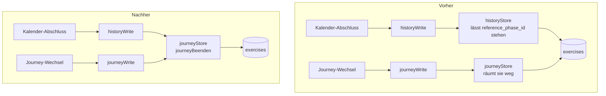
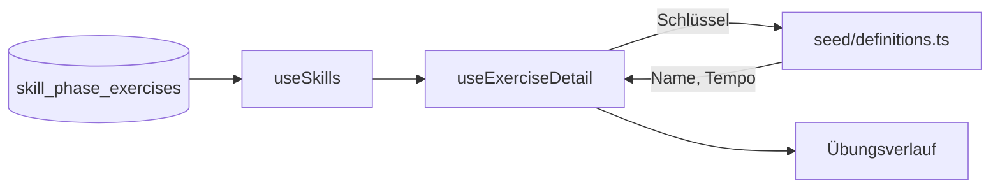

# Architektur-Review – August 2026

Momentaufnahme der architektonischen Reibung im Repo, erstellt am 24.08.2026 auf dem
Stand von `main` (Commit `e1277da`).

**Was dieses Dokument ist:** eine Kandidatenliste. Jeder Eintrag beschreibt eine Stelle,
an der ein Modul flach ist (das interface fast so komplex wie die implementation), an der
dieselbe Regel mehrfach steht, oder an der eine Regel dort liegt, wo kein Test sie
erreicht. Dazu je ein Vorschlag, wie sich das zu einem tieferen Modul zusammenziehen liesse.

**Was dieses Dokument nicht ist:** keine Entscheidung und kein Auftrag. Umgesetzt ist
davon bisher nur Kandidat 1 (Issue #379, siehe Vermerk dort); alles Übrige steht offen. Entschiedenes steht in [`docs/adr/`](./adr/README.md), der Ist-Zustand in
[`docs/Architektur.md`](./Architektur.md). Wird ein Kandidat gebaut, bekommt er vorher ein
Issue nach [`docs/Issue-Konventionen.md`](./Issue-Konventionen.md).

**Begriffe** (englisch, wie alle Architektur-Begriffe im Projekt): *module* – alles mit
interface und implementation. *interface* – alles, was ein Aufrufer wissen muss.
*deep/shallow* – viel bzw. wenig Verhalten hinter dem interface. *seam* – die Stelle, an
der das interface sitzt. *adapter* – was an einer seam eingehängt wird. *leverage* – was
Aufrufer aus der Tiefe gewinnen. *locality* – was Pflegende gewinnen: Änderung und Fehler
konzentrieren sich an einer Stelle. *deletion test* – würde Löschen des Moduls
Komplexität bündeln (dann trägt es etwas) oder nur verschieben (dann ist es ein
Durchreicher)?

---

## Ausgangslage: wo die Testlinie verläuft

| Ebene | Module | mit Test |
| --- | --- | --- |
| `src/engine` | 20 | 12 |
| `src/lib` | 94 | 67 |
| `src/hooks` | 74 | 1 (und der testet eine reine Funktion, nicht den Hook) |
| Komponenten + Routen | 148 | 0 |

15.337 Zeilen Test stehen 41.122 Zeilen Produktivcode gegenüber. Die Trennlinie
„getestet / nicht getestet" verläuft exakt an der Grenze `lib` ↔ `hooks`: Es gibt keine
React-Testbibliothek im Projekt, und `vite.config.ts` konfiguriert keine DOM-Umgebung für
Vitest. Jede Regel, die über diese Grenze rutscht, verliert ihre Absicherung. Mehrere der
folgenden Kandidaten sind Ausprägungen genau davon.

---

## 1. Das Ende einer Journey an eine seam legen

> **Umgesetzt** mit Issue #379. Der Abschnitt beschreibt ab „Problem" den Stand vor der
> Umsetzung; der heutige Stand steht in [`docs/Architektur.md`](./Architektur.md).

**Empfehlung: stark** · Abhängigkeit: ports & adapters

**Dateien:** `src/lib/historyStore.ts:99-116`, `src/lib/journeyStore.ts:124-131,173-191`,
`src/lib/historyWrite.ts:68`, `src/lib/journeyWrite.ts:226`

**Problem.** Dieselbe Regel „Journey endet" steht in zwei Stores – und die beiden Fassungen
räumen unterschiedlich auf. `archiveJourney` ist wortgleich doppelt vorhanden (je einmal im
Supabase- und im Speicher-Gesicht, also vier Implementierungen derselben Tatsache). Das
Wegräumen der Referenzgewichte ist es nicht: Der Weg über den Verlauf setzt Gewicht und
Startgewicht zurück, der Weg über die Journey zusätzlich den Phasenbezug. Der Kommentar im
Journey-Store beschreibt den Schaden, den der andere Weg anrichtet, bereits wörtlich – ein
Anker ohne Gewicht zeigt sonst auf eine Phase der abgelösten Journey.



**Lösung.** Ein Handgriff im Journey-Store, den beide Write-Bausteine benutzen. Das
Wegräumen der Anker steht danach einmal.

**Gewinn**

- locality: eine Regel, eine Stelle
- der Kalender-Abschluss räumt den Anker mit
- das interface verliert zwei Handgriffe
- ein Test erreicht beide Wege (heute prüft jeder Write-Test nur seinen eigenen
  Speicher-Store; kein Test vergleicht die beiden)
- deletion test: bündelt

**ADR-Bezug.** [ADR-0019](./adr/0019-schreibnaht-je-bereich.md) erlaubt bewusst, dass
dieselbe Tabelle in zwei Stores auftaucht. Hier sind es aber nicht zwei Zugriffe, sondern
zwei Fassungen derselben Regel. Kein Widerspruch zur ADR, sondern ihr Grenzfall.

---

## 2. Die Coach-Vorschau einmal verdrahten

**Empfehlung: stark** · Abhängigkeit: in-process

**Dateien:** `src/lib/liveBuild.ts:233-268`, `src/hooks/useCoachStatuses.ts:134-166`,
`src/hooks/useLiveCoachPreview.ts:147-197`

**Problem.** Die Kette hinter jedem Gewichtsvorschlag – Plan-Kontext, geltendes Repband,
Vorschlag samt Hantel, Phaseneintritt, Ausblick – ist dreimal von Hand gelegt. Zwei der
drei Fassungen liegen in Hooks und sind damit ohne Test. Eine der beiden trägt einen
Kommentar, der sie selbst als „Zwilling" der anderen bezeichnet, und einen zweiten, der
erklärt, warum ein Schritt nachträglich mitkopiert werden musste – die Beschreibung eines
bereits eingetretenen Auseinanderlaufens.

```text
Vorher                                    Nachher

liveBuild   useCoachSt.  useLiveCoach      liveBuild  useCoachSt.  useLiveCoach
   |             |             |               \          |          /
planContext  planContext  planContext           \         |         /
activeRep    activeRep    activeRep              +--------+--------+
suggestBar   suggestBar   suggestBar                       |
phaseEntry   phaseEntry   phaseEntry           +-----------------------+
             planOutlook  planOutlook          | coachForExercise()    |  <- deep
                                               |  planContext          |
 getestet     ohne Test    ohne Test           |  activeRep            |
                                               |  suggestBar           |
                                               |  phaseEntry/Outlook   |
                                               +-----------------------+
                                                      getestet
```

**Lösung.** Ein Modul, das aus Übung, Plan und Phase den fertigen Coach-Stand liefert. Die
Hooks beschaffen danach nur noch Daten.

**Gewinn**

- leverage: eine Kette, drei Aufrufer
- die Fassungen können nicht mehr auseinanderlaufen
- test surface deckt alle drei Wege statt nur einen
- eine neue Coach-Regel wird an einer Stelle nachgezogen statt an dreien
- deletion test: bündelt

---

## 3. Die Korrektur einer Einheit ist ein Modul

**Empfehlung: stark** · Abhängigkeit: in-process

**Dateien:** `src/components/history/SessionEditPanel.tsx:73-410` (545 Zeilen),
`src/lib/editSession.ts:99-230`

**Problem.** Der Entwurf einer Korrektur lebt vollständig in der Anzeigedatei: Aufbau des
Entwurfs je Sitzungsart, Satz ändern, ergänzen, löschen, Notiz setzen, dazu am Ende eine
dreifache Verzweigung nach Yoga, Skill und Kraft. Geprüft ist nur der letzte Handgriff –
das Bauen der Nutzlast in `editSession.ts`. Die seam sitzt also erst beim Speichern, und
die Verzweigung nach Sitzungsart steht doppelt: einmal in der Komponente, einmal in `lib`.

```text
Vorher                                  Nachher

+--------------------------------+      +--------------------------------+
| SessionEditPanel.tsx           |      | SessionEditPanel.tsx           |
|  buildDraft / Strength / Skill |      |  zeichnet, reicht weiter       |
|  updateSet / addSet / delSet   |      +--------------------------------+
|  updateSkillValue / addSkillSet|      - - - - - - seam - - - - - - - -
|  save(): yoga | skill | kraft  |      +--------------------------------+
+--------------------------------+      | Korrektur                (deep)|
- - - - - - seam - - - - - - - - -      |  entwurfAus(einheit)           |
+--------------------------------+      |  handgriff(entwurf, aktion)    |
| editSession.ts       getestet  |      |  nutzlast(entwurf)             |
+--------------------------------+      |                     getestet   |
                                        +--------------------------------+
```

**Lösung.** Ein Korrektur-Modul mit drei Handgriffen: Entwurf aus der Einheit, Handgriff auf
dem Entwurf, Nutzlast beim Speichern. Die Komponente zeichnet danach nur noch.

**Gewinn**

- interface: drei Handgriffe statt eines Dutzends innerer Funktionen
- locality: die Editier-Regeln stehen an einer Stelle
- die drei Sitzungsarten werden einmal verzweigt statt zweimal
- test surface erreicht erstmals das Bearbeiten, nicht nur das Speichern

---

## 4. Ein Register für die pausierbaren Schreibvorgänge

**Empfehlung: stark** · Abhängigkeit: ports & adapters

**Dateien:** `src/lib/queryClient.ts:34-45`, `editMutation.ts` (28 Zeilen),
`finishMutation.ts` (58), `finishSkillMutation.ts` (53), `templateActions.ts:83`,
`journeyWorkoutActions.ts:67`

**Problem.** Fünf fast gleiche Module registrieren je einen offline pausierbaren
Schreibvorgang; jedes besteht aus Kennung, Rumpf und Auffrischung. Die harte Invariante aus
[ADR-0009](./adr/0009-mutationsreihenfolge.md) – Kennungen und Registrier-Reihenfolge –
steht ausschliesslich als Kommentar in `queryClient.ts`. Kein Test nennt eine Kennung, kein
Test hält die Reihenfolge fest. Genau daran hängt aber, ob ohne Netz erfasste Änderungen
einen App-Neustart überleben.

```text
Vorher: fünf shallow modules            Nachher: ein Register

[interface]  [interface]  [interface]    schreibregister = [
[  impl   ]  [  impl   ]  [  impl   ]      { kennung, schreiber, auffrischung },
[interface]  [interface]                   { kennung, schreiber, auffrischung },
[  impl   ]  [  impl   ]                   ...
                                         ]
Reihenfolge = Kommentar                  Reihenfolge = Reihenfolge der Liste
```

**Lösung.** Ein Register nach dem Vorbild von `src/lib/bestandsregister.ts`: Kennung,
Schreiber und Auffrischung als Liste, eine Schleife registriert sie in Listenreihenfolge.
Genau diese Bauform hat das Projekt für die Datensicherung bereits – dort stand die Liste
vorher an acht Stellen von Hand.

**Gewinn**

- locality: die Reihenfolge wird Daten statt Verabredung
- ein Test statt fünf Kommentare
- das interface schrumpft auf eine Liste
- ein neuer Schreibvorgang ist eine Zeile

**ADR-Bezug.** [ADR-0009](./adr/0009-mutationsreihenfolge.md) bleibt unangetastet:
Kennungen und Reihenfolge ändern sich nicht, sie werden nur prüfbar. Der Umbau selbst
berührt den empfindlichsten Punkt der Offline-Datenschicht und gehört in einen eigenen,
kleinen Schritt.

---

## 5. Das Frequenzziel gehört in die Regel

**Empfehlung: stark** · Abhängigkeit: in-process

**Dateien:** `src/lib/phaseContext.ts:127`, neun Hooks plus
`src/routes/journey_.waehlen.tsx:98`, `src/lib/coachExport.ts:402`; Phasen-Mapping in
`src/lib/journey.ts:373`, `src/hooks/useJourneyView.ts:77`,
`src/hooks/useJourneyReview.ts:107`

**Problem.** Zehn Aufrufer setzen den Vorgabewert des wöchentlichen Frequenzziels selbst.
Neun schreiben ihn als „oder 3", der Coach-Export als „falls nicht vorhanden, 3" – das ist
nicht dasselbe: Steht in den Einstellungen eine gespeicherte 0, rechnet der Export mit 0
und die App mit 3. Dazu kommt das Mapping der Phasenzeile auf die Engine-Form, das dreimal
wortgleich abgeschrieben ist, obwohl `phaseContext.ts` bereits zwei solche Abbildungen
bereitstellt.

`derivePhaseContext` ist als „die eine Stelle für: wo stehe ich gerade" dokumentiert und
wird an acht Stellen aufgerufen – aber jeder Aufrufer muss das Frequenzziel selbst
beschaffen und selbst defaulten. Der Vorgabewert ist damit kein Teil der Regel, sondern
Aufrufer-Wissen.

**Lösung.** Der Wert geht roh in die Regel hinein (`number | null`), den Vorgabewert setzt
sie selbst. Dazu eine Abbildung `toPhaseInputs` neben die vorhandenen legen.

**Gewinn**

- locality: der Vorgabewert steht an einer Stelle
- Export und App rechnen wieder gleich
- Phasen-Mapping einmal statt dreimal
- der Test deckt den Vorgabewert ab (heute reichen alle 14 Testfälle ihn explizit herein)

---

## 6. Skill-Übungen kommen aus der Datenbank

**Empfehlung: stark** · Abhängigkeit: in-process

**Dateien:** `src/hooks/useExerciseDetail.ts:7,145-160`, `src/hooks/useSkills.ts:73`,
`src/seed/definitions.ts`

**Problem.** Der Übungsverlauf löst Skill-Übungen über die Konstanten im Code auf, obwohl
derselbe Hook die Daten in derselben Zeile bereits aus der Datenbank geladen hat. Der Weg
führt von der Datenbank über den Schlüssel zurück in den Code-Seed. Es ist der einzige
Import aus `src/seed/definitions.ts` ausserhalb von `src/lib/seed.ts`. Wird ein Skill in der
Datenbank geändert, zeigt der Übungsverlauf weiterhin den Code-Stand.



**Lösung.** Aus den geladenen Skill-Daten auflösen; der Umweg über den Seed fällt weg.

**Gewinn**

- eine Quelle statt zwei
- eine Änderung in der Datenbank wirkt sofort
- ein Import weniger quer durchs Repo
- deletion test: bündelt

**ADR-Bezug.** Kein Konflikt, im Gegenteil:
[ADR-0002](./adr/0002-definitionen-in-db.md) und
[ADR-0003](./adr/0003-skill-definitionen.md) legen fest, dass Definitionen in der Datenbank
liegen und über Query-Hooks gelesen werden. Dieser Pfad ist die letzte Stelle, die daran
vorbeigeht.

---

## 7. Die Ableitung unter die Testlinie ziehen

**Empfehlung: prüfenswert** · Abhängigkeit: in-process

**Dateien:** `src/hooks/useTrainingOverview.ts:141-411`,
`src/routes/journey_.waehlen.tsx:222-260`, `src/hooks/useJourneyView.ts:56-107`

**Problem.** Rund 270 Zeilen Ableitung stecken in einem einzigen `useMemo` im Hook, gespeist
aus elf Query-Hooks. Dasselbe Muster noch einmal in der Vorlagen-Route, die ihr
Ansichtsmodell selbst zusammensetzt – und deren Zwilling in `useJourneyView` fast dasselbe
für die laufende Journey baut. Keiner der drei Pfade ist ohne React aufrufbar, also ist
keiner getestet. Getestet ist jeweils nur, was schon in `lib/` liegt.

Der Kontrast im selben Verzeichnis ist deutlich: `useWorkoutsView` und `useExercisesView`
delegieren an getestete lib-Module und bleiben unter 46 Zeilen.

**Lösung.** Die Rümpfe als reine Funktionen nach `lib/` ziehen; Hook und Route beschaffen
nur noch Daten und reichen sie hinein.

**Gewinn**

- test surface: 270 Zeilen werden erreichbar
- der Hook schrumpft auf Datenbeschaffung
- Vorlagen- und Journey-Ansicht teilen dieselbe Regel
- folgt dem Muster, das die schlanken View-Hooks bereits vormachen

---

## 8. Der Chart-Baukasten ist zu flach

**Empfehlung: prüfenswert** · Abhängigkeit: in-process

**Dateien:** `src/components/ui/chart.tsx` (15 Helfer),
`src/components/exercise/ExerciseChart.tsx:149`,
`src/components/journey/JourneyExerciseChart.tsx:142`,
`src/components/journey/PeriodizationChart.tsx`, `src/components/body/BodyMetricChart.tsx:112`

**Problem.** Der Baukasten reicht fünfzehn kleine Helfer heraus – Linien, Flächen,
Verläufe, Tooltips, Farbtoken. Das eigentlich Schwierige baut jede der vier Kurven neu:
Skalen, Ränder, Wertebereiche, Ticks. Jede Kurve holt sich Farbtoken fünf- bis zehnmal
einzeln und legt ihre Rechnung Daten → Koordinaten in einen eigenen Zeichen-Rumpf. Nichts
davon ist getestet, weil es in `.tsx` liegt.

Das interface ist damit fast so komplex wie die implementation: Ein Aufrufer muss alle
fünfzehn Helfer kennen und sie selbst orchestrieren.

**Lösung.** Ein Chart-spec als interface – Serien, Wertebereich, Ticks, Tooltip-Zeilen –,
das Zeichnen wandert dahinter. Die Rechnung Daten → Koordinaten wird ein reines Modul.

**Gewinn**

- interface: ein spec statt fünfzehn Helfer
- die Rechnung wird testbar
- vier Kurven teilen ein Rezept statt es zu wiederholen
- leverage: eine neue Kurve ist ein spec

**ADR-Bezug.** [ADR-0010](./adr/0010-musclemap-imperative-svg.md) hält die Muskelkarte
bewusst imperativ. Das bleibt unberührt – hier geht es allein um die vier Kurven, und auch
die zeichnen weiterhin imperativ. Geändert wird nur, wo die Rechnung steht.

---

## 9. Die Cache-Marke aus den Schemas ableiten

**Empfehlung: prüfenswert** · Abhängigkeit: in-process

**Dateien:** `src/lib/offline.ts:11-33`, `src/main.tsx:57`, `src/schemas/` (18 Dateien)

**Problem.** Ob ein gespeicherter Offline-Stand beim Laden verworfen wird, hängt an einer
Marke, die jemand von Hand hochsetzen muss. Sie steht auf `v8` – achtmal ist das nötig
gewesen, und die Begründungen im Kopf der Datei lesen sich als Chronik von acht Vorfällen:
gecachte Zeilenformen, die es so nicht mehr gab, ein tagelang falsch angezeigter
Phasenname, ein Stand, der eine entfallene Spalte weiterführte. Nichts leitet die Marke
aus den Schemas ab, nichts prüft sie.

```text
Vorher                                   Nachher

schemas/ - - (von Hand) - -> CACHE_BUSTER   schemas/ --> fingerabdruck() --> Marke
           Mensch muss daran denken                    ändert sich von selbst
v2 v3 v4 v5 v6 v7 v8
```

**Lösung.** Die Marke aus den Row-Schemas ableiten, damit eine geänderte Zeilenform den
alten Stand von selbst verwirft.

**Gewinn**

- locality: Form und Marke liegen am selben Ort
- Vergessen wird unmöglich
- das Kommentar-Journal im Dateikopf wird überflüssig
- ein Test hält den Fingerabdruck fest

---

## Kleinere Befunde

- **Vier gleiche Gerätespeicher-Stores.** `usePinnedCharts`, `usePinnedGoals`,
  `useBodyMeasureView` und `useJourneySeries` haben denselben Rumpf (lesen, Abgleich über
  Tabs, Benachrichtigen), nur mit anderem Schlüssel. Ein gemeinsamer Baustein bündelt je
  rund 50 Zeilen. Dieselbe Bauform noch einmal in `lib/journeyDone.ts` und `lib/pwaUpdate.ts`.
- **`src/lib/seed.ts` ist der letzte Schreibweg ohne seam.** Zwölf direkte Zugriffe auf
  sieben Tabellen samt Reihenfolge-Wissen (Vorlage vor Vorlagenphasen, Skill vor
  Skill-Phasen) – genau die Art Abfolge, für die
  [ADR-0019](./adr/0019-schreibnaht-je-bereich.md) den Write-Baustein vorsieht. Er läuft bei
  jedem neuen Konto genau einmal und ist der einzige völlig ungeprüfte Schreibvorgang der App.
- **Zwölf Aktions-Hooks mit gleichem Skelett.** Der Rumpf ist bis auf drei Werte identisch.
  Auffällig an den Rändern: `useSkillActions` nennt ein Feld `isBusy`, das überall sonst
  `isPending` heisst.
- **Der Engine-Barrel wird häufiger umgangen als benutzt.** 23 Dateien lesen über
  `@/engine`, 40 Import-Zeilen greifen direkt auf das jeweilige Modul zu – in
  `lib/phaseContext.ts` und `lib/coach.ts` steht beides in derselben Datei. Damit gibt es
  keine Antwort auf die Frage, was das interface der Engine ist.
- **Ein Test prüft die Aufrufreihenfolge statt des Ergebnisses.** `journeyWrite.test.ts`
  vergleicht die ersten fünf Handgriffe als Liste. Eine fachlich gleichwertige Umstellung
  lässt ihn fehlschlagen, ohne dass etwas kaputt ist. Die übrigen Zusicherungen desselben
  Tests prüfen dagegen richtig gegen den Zustand.

---

## Geprüft und für gesund befunden

Diese Stellen sehen auf den ersten Blick nach Kandidaten aus, sind aber keine:

- **Die 16 Lese-Hooks über `tabelleLesen`.** Jeder ist kurz und trägt echte Konfiguration
  (Filter, Sortierung, Query-Schlüssel). Auflösen würde Komplexität nur verschieben, nicht
  bündeln – der deletion test fällt negativ aus. Einzige Ausnahme: `useJourney` und
  `useArchivedJourney` sind bis auf den Filter identisch.
- **Die acht Schreib-Stores.** Zwei adapters – Supabase im Betrieb, Speicher im Test –
  machen die seam echt statt hypothetisch. Der Journey-Store ist mit 17 Handgriffen der
  breiteste; [ADR-0019](./adr/0019-schreibnaht-je-bereich.md) nennt das bereits als bekannten
  Preis.
- **`derivePhaseContext`.** Ein deep module im besten Sinn: ein Aufruf, acht Aufrufer,
  vierzehn Testfälle. Vorbild für die Kandidaten 2 und 5.
- **`bestandsregister.ts`.** Genau die Bauform, die Kandidat 4 für die Schreibvorgänge
  vorschlägt – hier bereits vorhanden und durch Tests abgesichert.
- **Die Bausteine in `src/components/ui`.** Shallow, aber zu Recht: Sie tragen kein
  Verhalten, sondern Aussehen. Ihr leverage liegt in der Einheitlichkeit, nicht in der Tiefe.
- **`useLiveSession`.** Bleibt ein Modul,
  [ADR-0020](./adr/0020-live-store-bleibt-ein-modul.md). Wird hier nicht aufgerollt.
- **Der Journey-Bereich als Ganzes.** Rund 48 Dateien, aber kein flaches Modul darunter –
  jedes trägt eine eigene Aufgabe, und der Bereich ist der am besten getestete Teil des
  Repos. Die Reibung ist die schiere Anzahl: Das ist ein Navigations-, kein Schnittproblem.
  Ein Wegweiser in `docs/` („welches Modul beantwortet welche Journey-Frage") hilft mehr als
  ein Umbau.

---

## Top-Empfehlung

**Kandidat 1 – Das Ende einer Journey an eine seam legen.**

Als einziger Kandidat hat er heute einen sichtbaren Unterschied im Verhalten: Der Abschluss
über den Kalender lässt einen Phasenbezug stehen, den der Journey-Wechsel wegräumt – und der
Kommentar im anderen Store beschreibt den Schaden bereits. Er ist klein, er berührt keine
ADR-Entscheidung im Kern, und er macht eine Regel prüfbar, die heute an zwei Stellen
unterschiedlich steht.

Danach: Kandidat 5 (Frequenzziel) – dieselbe Art Befund, noch kleiner. Dann Kandidat 2
(Coach-Vorschau) – der grösste Gewinn an locality und test surface.
